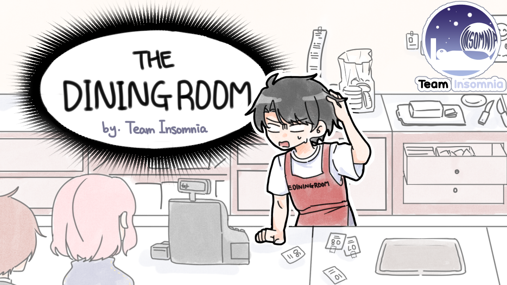
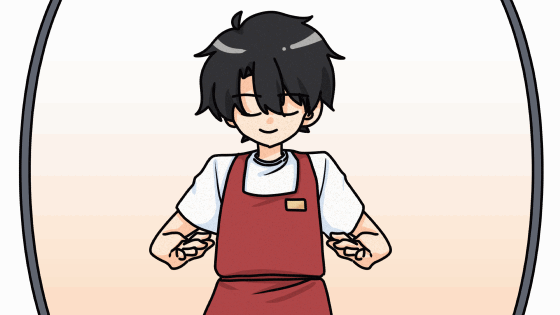

# Trailer

<video width="1280" height="780" controls>
  <source src="Video&image/Dining Room Trailer.mp4" type="video/mp4">
</video>

# GamePlay Video

<video width="1280" height="780" controls>
  <source src="Video&image/Dash_and_Thief_Trim.mp4" type="video/mp4">
</video>

<video width="1280" height="780" controls>
  <source src="Video&image/golddouble_Trim.mp4" type="video/mp4">
</video>

# Elevator pitch

Get the order from the customer, make what they want, and earn money from the customer. Finally become a CEO.

# Description

Introducing "The Dining Room," an immersive tycoon game that puts you in the shoes of a fast-food store owner. Prepare yourself for the ultimate challenge of running a successful
establishment where you'll experience firsthand just how demanding it can be.

Get ready to whip up delicious burgers and tantalizing side menus for the ever-hungry customers who flock to your
door. As you serve your culinary masterpieces, watch the profits roll in and use them strategically to enhance your skills and unlock a diverse range of ingredients.

But beware, the path to success is treacherous! Your ability to manage your customers'
satisfaction and maintain a stellar reputation is paramount. With each decision you make, the fate
of your store hangs in the balance. A single misstep could lead to financial ruin or a tarnished
reputation, spelling the end of your entrepreneurial journey.

"The Dining Room" offers an authentic and immersive experience, where you'll face the real-life challenges of a fast-food business. Immerse yourself in the exhilarating world of entrepreneurship as you grapple with limited resources, demanding customers, and ever-increasing expectations.

Only the most skilled and savvy players will rise to the top, conquering the cutthroat realm of
fast-food tycoons.

So, are you up for the challenge? Will you master the art of culinary delight and business acumen?
It's time to step into "The Dining Room" and prove your mettle as the ultimate fast-food tycoon.
Remember, every decision counts, every customer matters, and every dollar earned brings you
closer to greatness. Will you thrive or crumble under the pressure? The choice is yours.

# Developer contact information

Instagram : 
- [@c_lin_42](https://www.instagram.com/c_lin_42)
- [@juseung0701](https://www.instagram.com/juseung0701)
- [@co2xuz1y9](https://www.instagram.com/co2xuz1y9)
- [@truth0629](https://www.instagram.com/truth0629)

E-mail : 
- kathy020224@gmail.com
- juseung0701@naver.com
- shinyj0219@gmail.com
- truth0600@naver.com
- ymjgood11@gmail.com

# Features
- Story Mode
> The story mode provides simple story to make a bigger restaurant with handmade cutscenes. This mode will give a player 15-day long volume of gameplay experience.

- Infinite Mode
> For a repetitive gameplay, the dining room offers infinite mode. A player can enjoy infinitely continued burger tycoon gameplay. Reach a highest record!

- Impressive Hand-Drawn Assets
> All the assets created by a Art Lead offers atmosphere-matching graphics to make an immersive gameplay.

- Simple and Intuitive game controls and mechanics
> It is fast and easy to learn game mechanics with simple keyboard controls. Don't fear trying the game. You can easily get used to the game!

# Platforms and planned release dates
Platforms: Windows

System requirements: 
- Intel Quad-Core CPU or higher
- 4.00GB RAM or higher 
- 64-bit Operating System

# Price
$10

# Link to get game or demo or how to get a key
- [Game Download Link](https://drive.google.com/file/d/1k85_ayan7rRqN0FRXVTZAdXZ3_sjHHlq/view?usp=sharing)

# Developer Team
- Minki Cho: Producer
- MinJae Yu: Technical Lead
- Juseung Yang: Design Lead
- YeJin Shin: Test Lead & Audio Lead
- ChaeRin Park: Art Lead & Technical Lead

# Audio

<audio controls>
  <source src="./Sounds/The_Dining_Room_stage.wav" type="audio/mpeg">
</audio>

<audio controls>
  <source src="./Sounds/The_Dining_Room_main.wav" type="audio/mpeg">
</audio>

<audio controls>
  <source src="./Sounds/The_Dining_Room_howto.wav" type="audio/mpeg">
</audio>

<audio controls>
  <source src="./Sounds/Store_taken_bgm.wav" type="audio/mpeg">
</audio>

<audio controls>
  <source src="./Sounds/button_click.wav" type="audio/mpeg">
</audio>

---

# ScreenShot

 ---

